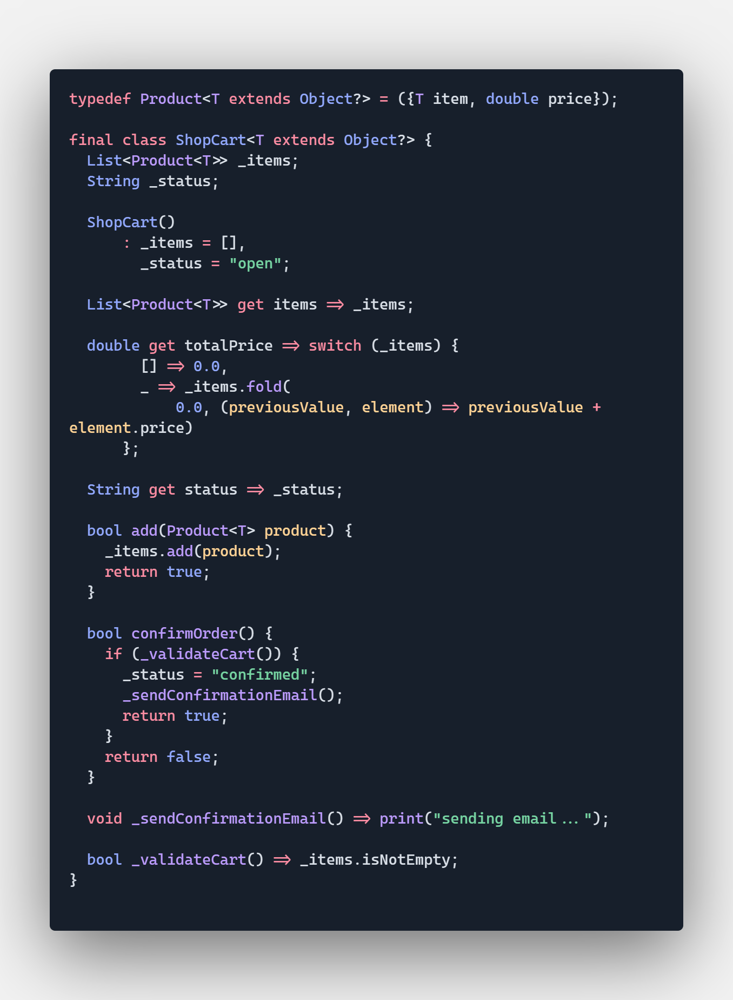

# Refactoring the Shop cart class

> A class should only one reason for change

## Problems

The old version class had 4 responsabilities, instead of one:

- Over the shop cart
- over the items
- over the order
- sending email
